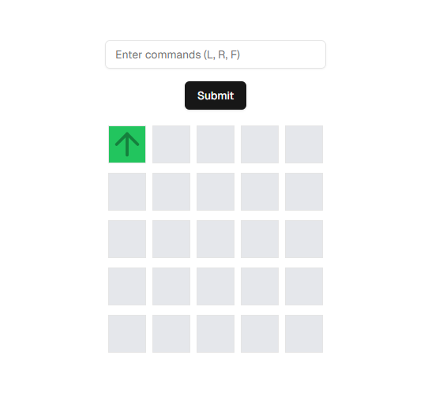

Requirements
1. React Application
Bootstrap a React/Typescript application. You may use any CSS framework (Tailwind for
example) or just vanilla CSS. Feel free to use any library.
Display a grid that visually represents the Martian surface/dimensions.
Create an Input field where the instructions can be provided for the robot.
Create a button that transmits the instructions to the robot.
Show the robot's movement step-by-step.
Highlight the robot's final position.
2. Movement
Robots must execute one command per second ( L , R , or F ).
Visually rotate the robot when turning ( L / R ).
Move the robot to the correct location when given the F command.

Rotation and movement can occur instantly. If you have time, animate the robot’s movement
with CSS transitions.
4. Extensibility
Design the code so it’s easy to add new features (e.g., multiple robots, obstacles, or additional
commands).
5. Testing
Write unit tests for the core logic (in priority order):
Parsing input.
Robot movement.
Grid boundary checks.

An example of the User Interface is provided below. You are welcome to replicate it or use it as
inspiration to design your own. Feel free to be creative!

Guidelines
Time Limit: Spend no more than 2 hours on this challenge. Focus on building a working solution
that demonstrates creativity and solid engineering principles. Aim for pragmatism over perfection
—avoid over-engineering. If you run out of time, include a brief note outlining what you would have
done with more time and how you might approach further improvements.
Tools: Use any CSS framework (Tailwind, etc.) and libraries of your choice.
Code Quality: Write clean, modular, and well-organized code.
Coding assistants: The use of coding assistants is permitted; however, successful candidates
must be prepared to thoroughly explain their code, reasoning, and decision-making process.

If any of the requirements are unclear, rely on your best judgment to proceed, and ensure that you
document any assumptions you make.
Have fun and be creative!

Our Evaluation Criteria
1. Correctness: Does the robot move according to the instructions?
2. Code Quality: Is the code clean, readable, and maintainable?
3. Extensibility: Can the solution handle future changes?
4. Testing: Are key parts of the program tested?

How to submit
To submit, upload a compressed file of your code (excluding the node_modules folder) using the link
provided in the email you received.

### Code structure
- Technologies used: Next.js, Shadcn, TailwindCSS
- Robot logic in robot.ts

